# AB Superstore - A US-based Online Marketplace

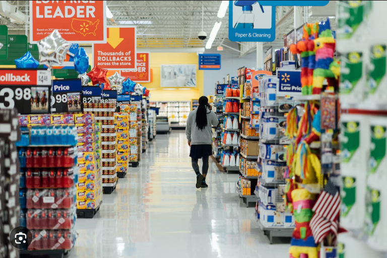

## Introduction

In this project, a comprehensive analysis was carried out on the operations of **AB Superstore**, a leading online superstor situated in the United States, which prides itself in its efficiency and timely response to her customers orders. Everyday, online courier companies face several challenges due to the dynamic nature of the industry and the increasing demands and expectations of customers. Analyzing the operations and financials of our online superstore and its courier services is crucial for optimizing efficiency, enhancing customer service, and ensuring profitability. In an era where the e-commerce industry is booming, a comprehensive analysis is a critical aspect of strategic business management providing valuable insights into customer behavior, market trends, and financial health, guiding the company in making informed decisions.

**_Disclaimer_** ⚠️- _All data used for this analysis are hypothetical data generated and do not represent any company's data or an attempt to endanger their performance._

## Problem Statement

The primary goal of this analysis is to gain valuable insights into its operations, sales, and customer behavior by looking at the company's key performance indicators and using our dataset to answer some business strategic questions. These revelations will provide the company with invaluable data, enabling them to enhance their weak points while maintaining strong customer relationships.

The task is to point at four (4) Key Performance Index (KPI’s) that tends to answer six business questions and also creating Pivot Tables and visuals displaying insights to the following questions:
1. What is the longest time taken to process an order?
2. What is the average revenue by year?
3. What is the total profit by region?
4. What is the most used shipping mode?
5. What is the total number of transactions and quantity of products sold yearly?
6. What is the largest customer segment? 

## Data Sourcing 

The comapny's data was provided in Excel CSV format. The data-set contained information about the comapany performance which comprised of columns categorized into order ID, customer names, shipping mode, customer ID, order date, delivery date, product category, product segments, quantity, sales, profits and discounts.

## Data Transformation

The data was converterd to a proper Excel worksheet and arranged properly. To ensure a smooth workflow, data was cleaned and combed through for duplicates. 

## Skills and Concepts

The following Microsoft Excel features were demonstrated in this analysis:
- Data Cleaning.
- Sum and Count
- Sorting
- Filters
- Pivot Tables
- Visualization (Column charts, Donut charts, line graphs)

## Analysis

The report comprises 2 sheets:
1. The spreadsheet with the dataset.
2. The Pivot tables with their visuals.

Our superstore dataset is comprised of 9995 rows with a total of 9994 transactions covered in 5 years.

You can view the raw report file [here](https://github.com/MsSandie/US-store-Analysis/blob/main/US_superstores.xlsx)

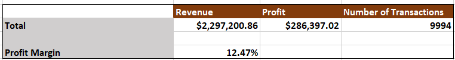

**Features**
- Total Revenue was calculated as $2,297,200.86, it ascertains the total income generated by the superstore.
- Total Profit was calculated as $286,397.02, which ascertains the financial gain of the superstore after deducting all its expenses from its total revenue.
- The Profit Margin calculated as 12.47%, which is a financial metric that represents the percentage of revenue our superstore retains as profit after all expenses have been deducted. 

# Pivot Table Analysis and Visualization

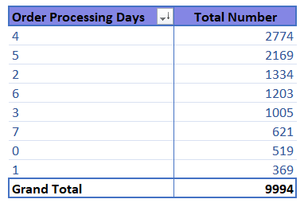                                    |                                  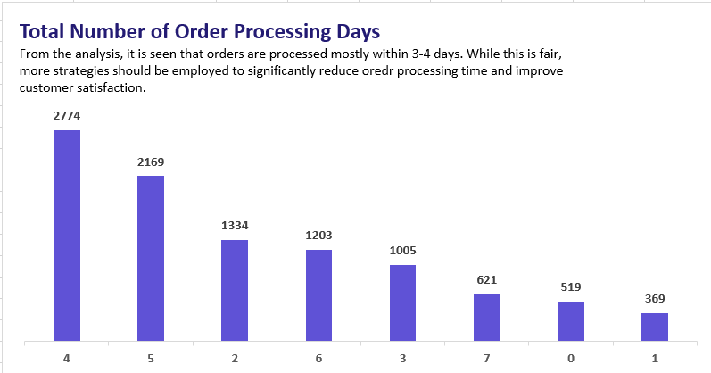
:--------------------------------------------------:|:--------------------------------------------------------------------:

**From our analysis, it is seen that orders are processed mostly in 4 days, followed by 3 days. While this is fair, more strategies should be employed to significantly reduce order processing time and improve customer satisfaction.**

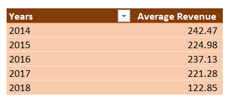                                    |                                  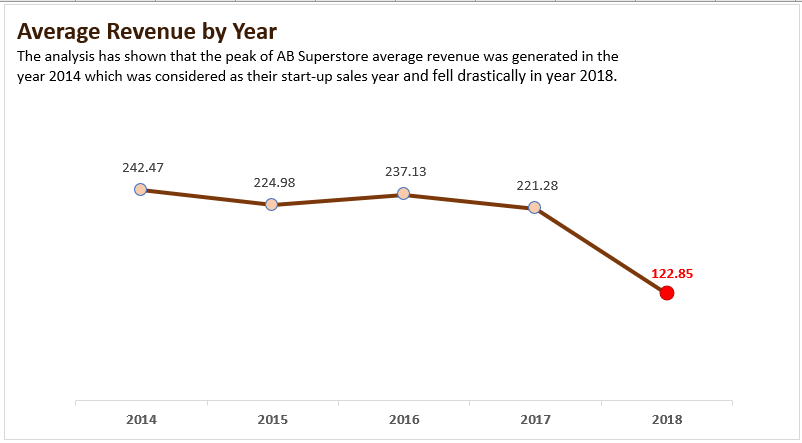
:--------------------------------------------------:|:--------------------------------------------------------------------:

**Average revenue of the store calculated the number of years in our data-set. The pivot table and line graph shows that the peak of our Superstore average revenue was generated in the year 2014 which we consider as their start-up sales year and the it fell drastically in year 2018.**

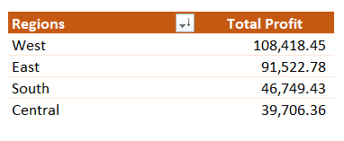                                    |                                  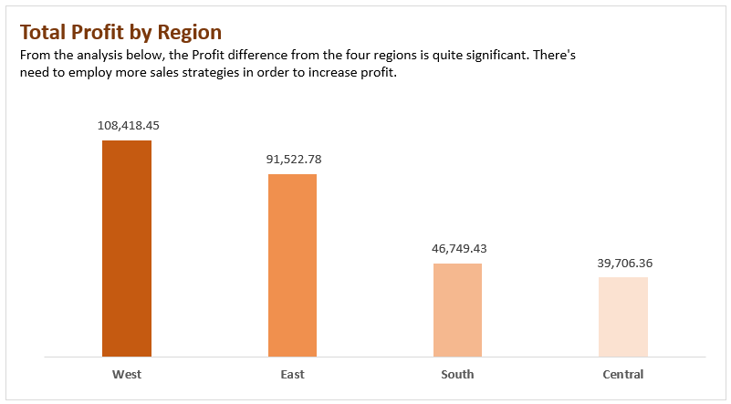
:--------------------------------------------------:|:--------------------------------------------------------------------:

**The stores total profit calculated by regions which places the West as the highest profit generating region.**

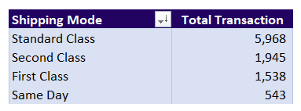                                    |                                  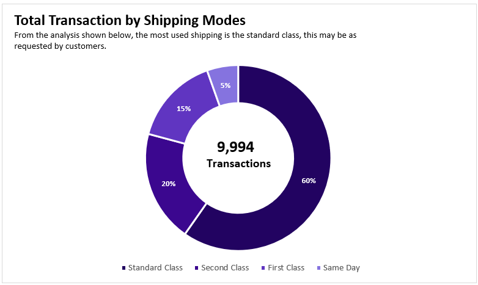
:--------------------------------------------------:|:--------------------------------------------------------------------:

**The transaction by shipping modes was calculated and standard shipping seems to be the most sort after by customers.**

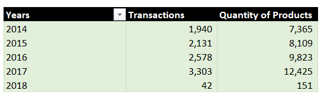                                    |                                  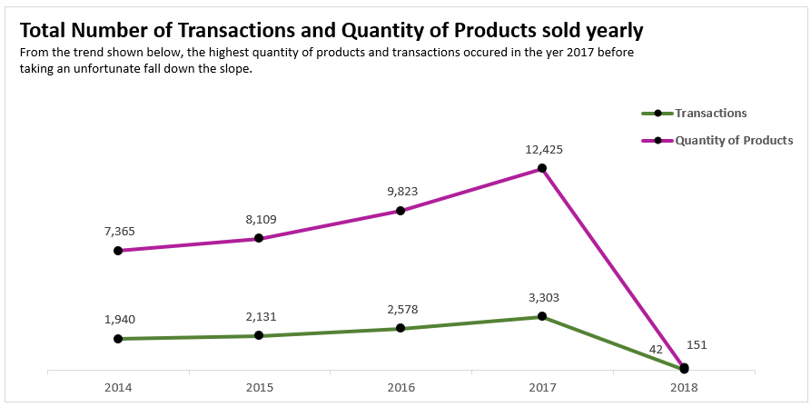
:--------------------------------------------------:|:--------------------------------------------------------------------:

**Total number of transactions and quantity of products sold yearly was calculated, and was discovered that the highest quantity of products and transactions occured in the year 2017.**

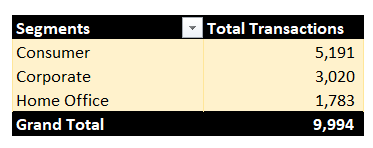                                    |                                  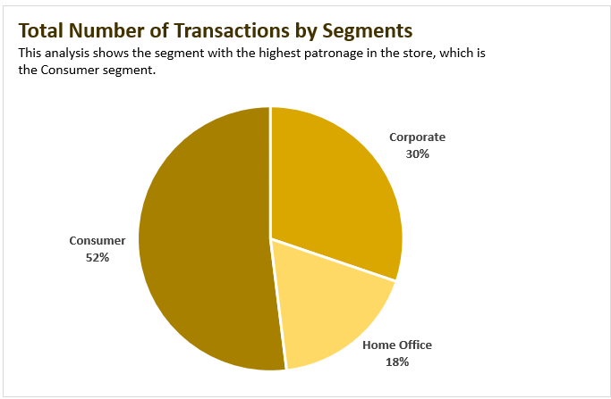
:--------------------------------------------------:|:--------------------------------------------------------------------:

**The transaction by segments was calculated and the consumer product segment was found to be the most sort after by customers of the store.**

# Conclusion and Recommendations

1. The total number of transactions carried out from 2014-2018 was calculated to be 9994 with the highest number of transactions and quantity of products sold in the year 2017. The total Revenue of $2,297,200.86 was made mostly between 2014-2017 but received a massive decline in 2018. Which we presume is as a result of incomplete data for the year 2018, as it was only January 2018 that was captured in our data set for shipping.
2. The store having a profit margin of 12.47% indicates a healthy financial position, allowing for reinvestment in the business and potential expansion; with a total profit of 286,397.02, it is seen that profit increased with increasing sales.
3. The highest duration of time taken to process an order for shipping was calculated to be 4 days, with the shortest days between 7 to 1. This gives us a clear picture of the delay challenge faced by shipping companies while trying to transport goods. Customers’ impact also plays a major role in the shipping process, as it is seen from our data that the standard shipping mode was the most sort after by customers and invariably the most used by the superstore to ship orders. This may be as a result of the cost implications associated with the different shipping modes. The shipping duration may also be related to the shipping mode used.
4. The profit turnout had the Western region with the highest turnout for the store, with a whopping $108,418.45 and the central region with the lowest profit turnout. We recommend that more marketing strategies should be carried out in the Central and Southern region to boost sales and make better profits. Also, some mouth-watering promotional offers should be made available from time-to-time to boost customer loyalty and patronage in the various regions especially the West, with the highest turnout.
5. Finally, the goal of a business is to generate revenue and maximize profits while ensuring customer satisfaction. For this goal to be continuously achieved, we recommend effective ways to increase sales and make production and delivery seamless while maintaining quality. Ultimately, the goal should be to create a sustainable and profitable business by delivering value to customers and ensuring their needs are met effectively.💪

As it is said, **“A Satisfied Customer is the best business strategy of all”** 😊 - Michael LeBoeuf.

